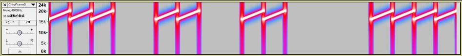

# Ultrasonic communication by STM32L4's DSP and MEMS microphone

## Preparation: STM32L4 platform and FFT test code on MEMS mic

This project uses STM32L476RG as MCU and MP34ST01-M as MEMS microphone:

The architecture is as follows:

==> [Platform](PLATFORM.md)

==> [Test code](./basic)

## Ultrasonic communications experiment (FSK modulation)

==> [Experiment](EXPERIMENT.md)

==> [Test code](./ultracom)

Conclusion: the method (sort of FSK modulation) work very well in a silent room, but did not work in a noisy environment such as a meeting room. I have to come up with another approach, such as spread spectrum.

## Chirp modulation experiment

### Two kinds of noises

I observed two kinds of noises in a room:

- Constant noises at specific frequencies: noises from motors/inverters???
- Bursty noises in a short period: cough, folding paper etc.

I _guess_ Chirp modulation might be suitable for ultrasonic communications in a noisy environment. No proof yet.

### Chirp modulation

Spectrum is spread out like Mt. Fuji:

### Chirp de-modulation

All the frequencies appear in one TQ(Time Quantum). I used [Audacity](https://www.audacityteam.org/) to capture the spectrogram:

Reference: 
- [Chirp compression (Wikipedia)](https://en.wikipedia.org/wiki/Chirp_compression)
- [Chirp A New Radar Technique](http://www.rfcafe.com/references/electronics-world/chirp-new-radar-technique-january-1965-electronics-world.htm)
- [Radar Pulse Compression](https://www.ittc.ku.edu/workshops/Summer2004Lectures/Radar_Pulse_Compression.pdf)

### DFSDM setting

|Parameter    |Value/setting|
|-------------|-----|
|System clock |80MHz|
|Clock divider|25 (3.2MHz over-sampling)|
|Filter       |sinc3|
|Decimation   |32   |
|Sampling rate|100kHz|

### FFT setting

|Parameter    |Value/setting|
|-------------|-----|
|DMA interrupt|2048 samples/interrupt|

### Time Quantum (TQ)

1/100kHz * 2048samples/interrupt = 20.5 msec

### Frame synchronization technique (tentative)

#### Example: Ascii "S" character code (0x53)

[WAV file of "S"](./generator/ChirpFrameS.wav) generated by [this Jupyter notebook](./generator/ChirpFrameGenerator.ipynb).

### Transmission speed

8bits * 1000 / (20.5(msec) * 19) = 20.5bps

### FFT output from STM32L4 DSP with MEMS mic

I used a very cheap speaker (100yen: $1) with my laptop PC to playback the "S" wav file.

Sweep range: 16000Hz - 16000Hz

Sweep range: 16000Hz - 17000Hz

Sweep range: 16000Hz - 18000Hz

### Chirp expriment on May 29, 2018

Regarding S/N ratio and reachability, it achieved a great improvement, thanks to chirp modulation.

And sweep range 16000Hz - 18000Hz seemed to show the best result.

==> [Test code](./chirp)

## My original MEMS mic shield

I have bought [this MEMS mic](http://akizukidenshi.com/catalog/g/gM-05577/): Knowles SPM0405HD4H. The spec is similar to the mic on the expansion board from STMicro. Although this one does not support ultrasonic, it should be OK.

I am going to make my original shield with Knowles MEMS mic:

- Knowles MEMS mic
- LCDs
- LEDs
- Tactile switches
- CAN tranceiver
