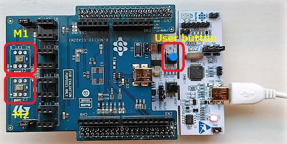
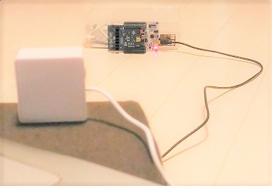
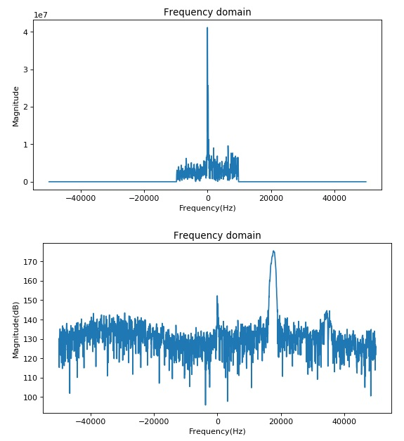

# Ultrasonic communications (Arm Cortex-M4 w/ MEMS mic)


[fig] Chirp signal generated by Jupyter Notebook

## Background and motivation

STMicro gave me STM32L4(Arm Cortex-M4) evaluation board and a pair of MEMS microphones for free at [a trade show held in Makuhari city](https://www.st.com/content/st_com/en/about/events/events.html/techno-frontier-2018.html), Chiba, Japan. Thanks a lot to STMicro!

As an IoT hobyyist, I am becoming interested in DSP with MEMS mic.

Also thanks to this: https://github.com/y2kblog/NUCLEO-L476RG_DFSDM_PDM-Mic.

## Project goal

I am a DSP beginner, so I learn DSP by doing: realize "low-power narrow area networking" by cheap DSP and MEMS mic.

## Project documentation

==> [Specification](https://docs.google.com/presentation/d/e/2PACX-1vSd3PQnKqmKbjcGNyNh_gygd175jgfzZYH5iwcEPqmmgiy7k3yYzqqHzfs7u-95jm_9hHgc0ugAvv2U/pub?start=false&loop=false&delayms=3000)

## Platform: STM32L4 platform and FFT test code on MEMS mic

This project uses STM32L476RG as MCU/DSP and MP34ST01-M as MEMS microphone:



The system architecture is as follows:


==> [Platform](PLATFORM.md)

==> [Test code](./experiments/basic)

## Mathematical formula expressing ultrasonic wave

I tested frequency-hopping to tranmit data over ultra-sonic, resulting in very bad performance at low SNR in a noisy room. So I decided to employ chirp modulation in this project.

==> [Formula](./misc/Formula.ipynb)

## Work ongoing

### Simulation of orthogonal chirp

Since I/Q modulation code did not fit into RAM of STM32, I am trying orthogonal chirp instead.

==> [Simulation](./simulation/OrthogonalChirp.ipynb)

### Experiment of orthogonal chirp (June 29, 2018)

Very weak orthogonal chirp tone was transmitted to the receiver:



The receiver could detect the signal and showed a strong peak of magnitude around zero Hz, as long as its time frame is in sync with the transmitter:



==> [Test code](./synchronization)

### Experiment of synchronous addition (July 7, 2018)

[Condition]
- Volume 18 at my DELL PC (Win10)
- The receiver is 2 meters away from the transmitter(speaker)

[Results]

DFSDM setting:
- sinc5 showed better SNR than sinc3 filter 

Synchrouns addition:
- addition of two frames improved SNR twice, but the ratio between magnitude of upchirp and magnitude of downchirp did not improved.
- addition of two frames tends to become out of sync faster.
- addition of three frames was useless.

FFT per one frame
```
G => S
-,   0.8
-,   0.8
-,   1.1
-,   2.4
-,   3.1
+,   3.4
-,   2.6
-,   1.3
S => S
U,   3.3
-,   1.5
L,   3.4
-,   2.3
S => S
U,   3.2
-,   1.2
-,   2.4
-,   3.1
```

FFT per addition of two frames
```
G => S
+,   3.9
-,   2.6
-,   3.5
-,   1.3
-,   1.8
-,   0.5
-,   1.9
-,   3.0
S => S
U,   4.8
-,   2.7
-,   3.7
-,   4.6
S => S
U,   4.2
-,   2.4
-,   3.6
R,   4.3
```

[Conclusion]
- Go with FFT per addition of two frames, for the time being.

### Expressing data in symbol

This implementation use up-chirp and down-chirp to express 0 and 1:

- up-chirp means 0.
- down-chirp means 1.

So one symbol contains 1 bit info.

### Improving SNR (signal-to-noise ratio)

- Bandwidth optimization.
- Synchronous addition: multiple sets of 2048 PCM samples.
- Hardware sinc filter optimization on DFSDM.

### Frame synchronization problems

Unsynchronized chirp results in two peaks.

==> [Simulation](./simulation/ChirpSynchronization.ipynb)

Assuming that the clock accuracy of the transmitter and the receiver is bad, sync position adjustment is required even after synchronization, maybe every 8 time frames.

### Developing my original MEMS mic shield

I have bought [this MEMS mic](http://akizukidenshi.com/catalog/g/gM-05577/): Knowles SPM0405HD4H. The spec is similar to the mic on the expansion board from STMicro. Although this one does not support ultrasonic, it should be OK.


I am going to make my original shield with Knowles MEMS mic:

- Knowles MEMS mic
- Character LCD
- Small OEL display
- LEDs
- Tactile switches
- EEPROM

## Experiments I made over the past month

I have made several experiments over the past month to study how data can be transmitted over ultra-sonic wave: FSK, hopping and chirp. The conclusion is to try Chirp modulation to fight with noise.

#### Ultrasonic communications experiment (FSK modulation)

==> [Experiment](./experiments/EXPERIMENT.md)

==> [Test code](./experiments/ultracom)

#### Ultrasonic communications experiment (Chirp modulation)


==> [Experiment2](./experiments/EXPERIMENT2.md)

==> [Test code](./experiments/chirp)

#### Ultrasonic communications experiment (Chirp modulation with compression)

==> [Experiment3](./experiments/EXPERIMENT3.md)
