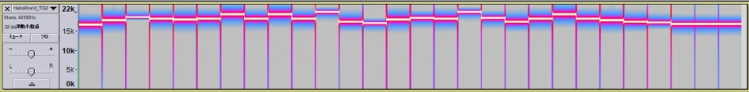
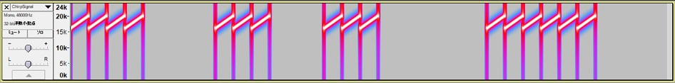

# Ultrasonic communication by STM32L4's DSP and MEMS microphone





## Preparation: STM32L4 platform and FFT test code on MEMS mic

This project uses STM32L476RG as MCU and MP34ST01-M as MEMS microphone.


==> [Platform](PLATFORM.md)

==> [Test code](./basic)

## Ultrasonic communications experiment (FSK modulation)

==> [Experiment](EXPERIMENT.md)

==> [Test code](./ultracom)

Conclusion: the method (sort of FSK modulation) work very well in a silent room, but did not work in a noisy environment such as a meeting room. I have to come up with another approach, such as spread spectrum.

## Knowles MEMS mic


I have bought [this MEMS mic](http://akizukidenshi.com/catalog/g/gM-05577/): Knowles SPM0405HD4H. The spec is similar to the mic on the expansion board from STMicro. Although this one does not support ultrasonic, it should be OK.

## Chirp modulation experiment

### Two kinds of noises

I observed two kinds of noises in a room:

- Constant noises at specific frequencies: noises from motors/inverters???
- Bursty noises in a short period: cough, folding paper etc.

I _guess_ Chirp modulation might be suitable for ultrasonic communications in a noisy environment. No proof yet.
### Chirp modulation

Spectrum is spread out like Mt. Fuji:


### Chirp de-modulation

All the frequencies appear in one TQ(Time Quantum). I used [Audacity](https://www.audacityteam.org/) to capture the spectrogram:


Chirp is converted into sinc wave by the following formula:

Reference: [Chirp compression (Wikipedia)](https://en.wikipedia.org/wiki/Chirp_compression)

```
If a chirp sequence is a(n) and that for the compression filter is b(n), then the compressed pulse sequence c(n) is given by

c1(n)=IFFT[FFT{a(n)}*FFT{b(n)}]
```

Other references:
- [Chirp A New Radar Technique](http://www.rfcafe.com/references/electronics-world/chirp-new-radar-technique-january-1965-electronics-world.htm)
- [Radar Pulse Compression](https://www.ittc.ku.edu/workshops/Summer2004Lectures/Radar_Pulse_Compression.pdf)

### DFSDM setting

|Parameter    |Value/setting|
|-------------|-----|
|System clock |80MHz|
|Clock divider|25 (3.2MHz over-sampling)|
|Decimation   |32   |
|Filter       |sinc3|
|Sampling rate|100kHz|

### FFT setting

|Parameter    |Value/setting|
|-------------|-----|
|DMA interrupt|2048 samples/interrupt|
|SFFT         | TBD |

### Time Quantum (TQ)

1/100kHz * 2048samples/interrupt = 20.5 msec

### Frame (tentative)

"Start of frame" is to detect the beginning of transmission and also for frame synchronization with the transmitter.

```
Segment length: TQ[msec] = 20.5msec

Start of frame: 5TQ length
Bit: 3TQ length
End of frame: 5TQ length

Frame (656msec)
<- SOF    ->      <- Bit 0  ->   <- Bit 7  -><- EOF    ->
[S][S][S][S][Void][B0][B0][B0]...[B7][B7][B7][E][E][E][E]
    82msec          61.5msec       61.5msec     82msec

 ----------        ----------                 
             ----                 ----------  ----------
                            
Start of Frame
1: Chirp

End of frame
0: No chirp

Bit value
0: No chirp
1: Chirp

Void
0: No chirp
```

[Example] Ascii "S" character code (0x53)


### Transmission speed

It is quite slow! I will optimize each parameters to attain faster bit rate.

8bits * 1000(msec) / 656(msec) = 12bps

### Test code

In development...
