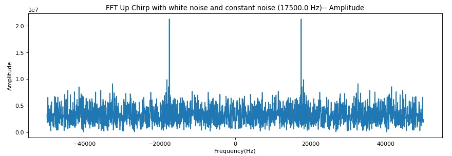
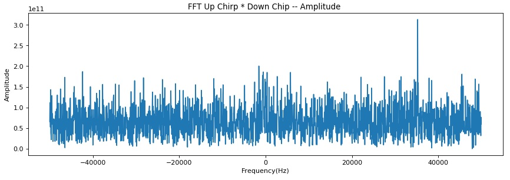
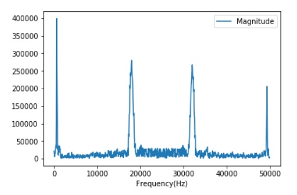
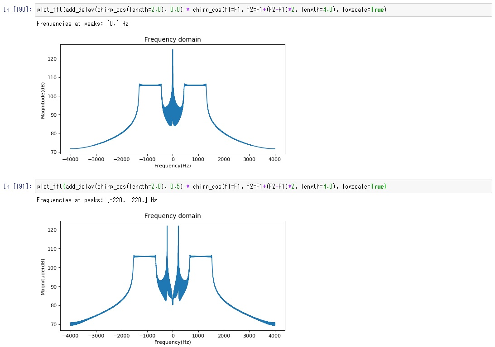

# Ultrasonic communications (STM32L4 DSP w/ MEMS mic)

STMicro gave me STM32L4 evaluation board and a pair of MEMS microphones for free at [a trade show held in Makuhari city](https://www.st.com/content/st_com/en/about/events/events.html/techno-frontier-2018.html), Chiba, Japan. Thanks a lot to STMicro! As an IoT hobyyist, I am becoming interested in developing an IoT demo using DSP with MEMS mic.

## Preparation: STM32L4 platform and FFT test code on MEMS mic

This project uses STM32L476RG as MCU/DSP and MP34ST01-M as MEMS microphone:

The system architecture is as follows:

==> [Platform](PLATFORM.md)

==> [Test code](./basic)

## Ultrasonic communications experiment (FSK modulation)

My first idea was FSK modulation of 18 frequencies (18 symboles) to send data on ultrasonic wave. The method worked very well in a silent room, but did not work in a noisy environment such as a meeting room. I had to come up with another approach, such as spread spectrum.

==> [Experiment](EXPERIMENT.md)

==> [Test code](./ultracom)

## Ultrasonic communications experiment (Chirp modulation)

I tested Chirp modulation as one of spread spectrum techniques. It worked! But the noise problem still remained, and the result was useless in a noisy room. I had to come up with a noise suppression technique such as Chirp compression.

==> [Experiment2](EXPERIMENT2.md)

==> [Test code](./chirp)

## Ultrasonic communications experiment (Chirp modulation with compression)

This time, I employ some compression technique, and chirp sweep time corresponds to the length of time within time frame, unlike the previous experiment.

This material is great: https://www.ittc.ku.edu/workshops/Summer2004Lectures/Radar_Pulse_Compression.pdf

### The first chirp compression experiment on STM32L4 DSP (June 10, 2018)

I tried Chirp compression in frequency domain (Upchirp * Downchip before Upchirp * Upchirp). I transmitted very weak chirp signals to STM32L4 DSP with MEMS mic. It worked! But I observed two peaks most of time, since the FFT calculation was performed on a chirp signal split into two within the time frame, since the time frame was not in sync between the transmitter and the receiver.

#### How much time does it take to compute complex FFT of 2048 samples?

The measured value is 3msec for each complex FFT of 2048 samples at 80MHz system clock. 2048 samples correspond to 20.5msec at 100kHz sampling rate, so 3msec is short enough compared to 20.5msec.

### Simulation of chirp compression on Jupyter Notebook (June 20, 2018)

I made [chirp compression simulator](./simulation/ChirpSimulation.ipynb) on Jupyter Notebook.

The chirp signal is under white noise:

I made FFT [upchirp * upchirp], then the chirp signal became identifiable at around zero Hz:

I also tried IFFT [FFT[upchirp] * FFT[downchirp]] to simulate Chirp compression in time domain. Again, the chirp signal is under noise level, but the chirp signal is identifiable around zero Hz after compression. The good thing of this technique is that it does not require a larger buffer (i.e., larger memory) for compression processing, and it can also detect phase shift of chirp signal by measuring the shift of peak to the left or to the right:

### The second chirp compression experiment on STM32L4 DSP (June 21, 2018)

The technique of chirp compression in time domain resulted in bad compression in a real experiment on STM32L4 w/ MEMS mic.

On the contrary, an experiment of FFT [upchirp * upchirp] on STM32L4 w/ MEMS mic showed a very good result:

So I have decided to employ FFT [upchirp * upchirp] for this project.

### Next steps

#### Frame synchronization problems

The phase difference between chirp from the transmitter and chirp from the receiver results in two peaks around zero Hz.

Minimize the phase difference for synchronization (to maximize correlation).

I have come up with the following method:

#### sinc filter optimization (moving average)

sinc5 filter reduces high-frequency noises more than sinc3. But it might not be so important...

## My original MEMS mic shield

I have bought [this MEMS mic](http://akizukidenshi.com/catalog/g/gM-05577/): Knowles SPM0405HD4H. The spec is similar to the mic on the expansion board from STMicro. Although this one does not support ultrasonic, it should be OK.

I am going to make my original shield with Knowles MEMS mic:

- Knowles MEMS mic
- LCDs
- LEDs
- Tactile switches
- CAN tranceiver
