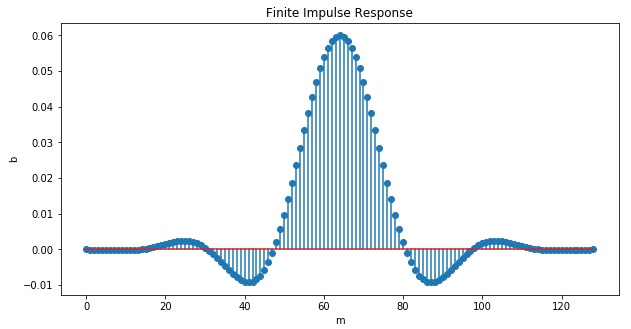

# Ultrasonic communications (Arm Cortex-M4 w/ MEMS mic)

## Background and motivation

STMicro gave me STM32L4(Arm Cortex-M4) evaluation board and a pair of MEMS microphones for free at [a trade show held in Makuhari city](https://www.st.com/content/st_com/en/about/events/events.html/techno-frontier-2018.html), Chiba, Japan. Thanks a lot to STMicro!

As an IoT hobyyist, I am becoming interested in DSP with MEMS mic.

## Platform: STM32L4 platform and FFT test code on MEMS mic

This project uses STM32L476RG as MCU/DSP and MP34ST01-M as MEMS microphone:

The system architecture is as follows:

==> [Platform](PLATFORM.md)

==> [Test code](./basic)

## Experiments

I have made several experiments over the past month to study how data can be transmitted over ultra-sonic wave: FSK, hopping and chirp. The conclusion is to try Chirp modulation to fight with noise. I will make another experiment in the near future to test OFDM and CDMA as well.

==> [EXPERIMENTS](EXPERIMENTS.md)

### IQ modulation

I tried IQ modulation to see if SNR improves.

==> [Formula](./misc/Formula.ipynb)

==> [Simulation](./simulation/IQ_modulation.ipynb)

IQ demoduation requires Low-Pass Filter(LPF) to remove unnecessary frequencies for baseband signal analysis. I have made LPF simulation and calculated FIR coefficients.

==> [Simulation](./simulation/FIR%20LPF%20design.ipynb)

However, my C program with "digital" IQ modulation did not fit into RAM on STM32! I gave up this approach, and I will try "Orthogonal Chirp" instead.

### Spreading chirp along time axis

Due to the limited RAM size, this approach is not appropriate. Synchronous addition is another way to increase the gain, but the transmission speed becomes very small.

## Current work

### Orthogonal chirp

I made simulation of Orthogonal chirp (mixing cosine chirp and sine chirp) and synchronous addition. I confirmed that those methods improve SNR on the receiver.

==> [Simulation](./simulation/OrthogonalChirp.ipynb)

### Expressing data in symbol

This implementation use up-chirp and down-chirp to express 0 and 1:

- up-chirp means 0.
- down-chirp means 1.

So one symbol contains 1 bit info.

### Improving SNR (signal-to-noise ratio)

- Bandwidth optimization.
- Synchronous addition: multiple sets of 2048 PCM samples.
- Hardware sinc filter optimization on DFSDM.

### Frame synchronization problems

Unsynchronized chirp results in two peaks.

==> [Simulation](./simulation/ChirpSynchronization.ipynb)

I have come up with the following method for synchronization:

Assuming that the clock accuracy of the transmitter and the receiver is bad, sync position adjustment is required even after synchronization, maybe every 8 time frames.

### Developing my original MEMS mic shield

I have bought [this MEMS mic](http://akizukidenshi.com/catalog/g/gM-05577/): Knowles SPM0405HD4H. The spec is similar to the mic on the expansion board from STMicro. Although this one does not support ultrasonic, it should be OK.

I am going to make my original shield with Knowles MEMS mic:

- Knowles MEMS mic
- LCDs
- LEDs
- Tactile switches
- CAN tranceiver
