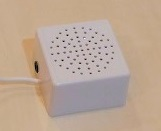
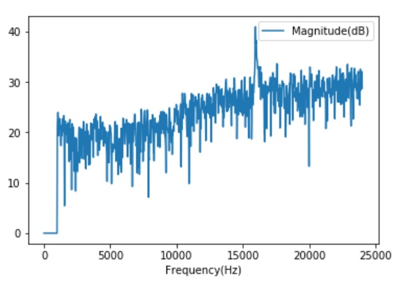
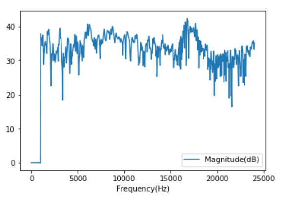
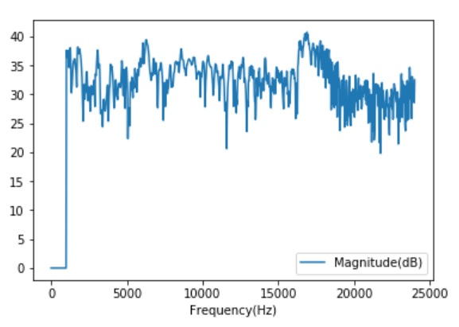

# Ultrasonic communications by STM32L4's DSP and MEMS mic


## Preparation: STM32L4 platform and FFT test code on MEMS mic

This project uses STM32L476RG as MCU and MP34ST01-M as MEMS microphone:


The system architecture is as follows:


==> [Platform](PLATFORM.md)

==> [Test code](./basic)

## Ultrasonic communications experiment (FSK modulation)

==> [Experiment](EXPERIMENT.md)

==> [Test code](./ultracom)

Conclusion: the method (sort of FSK modulation) work very well in a silent room, but did not work in a noisy environment such as a meeting room. I have to come up with another approach, such as spread spectrum.

## Chirp modulation experiment

### Two kinds of noises

I observed two kinds of noises in a room:

- Constant noises at specific frequencies: noises from motors/inverters???
- Bursty noises in a short period: cough, folding paper etc.

I _guess_ Chirp modulation might be suitable for ultrasonic communications in a noisy environment. No proof yet.

### Chirp modulation

Spectrum is spread out like Mt. Fuji:


### Chirp de-modulation

All the frequencies appear in one TQ(Time Quantum). I used [Audacity](https://www.audacityteam.org/) to capture the spectrogram:


Reference: 
- [Chirp compression (Wikipedia)](https://en.wikipedia.org/wiki/Chirp_compression)
- [Chirp A New Radar Technique](http://www.rfcafe.com/references/electronics-world/chirp-new-radar-technique-january-1965-electronics-world.htm)
- [Radar Pulse Compression](https://www.ittc.ku.edu/workshops/Summer2004Lectures/Radar_Pulse_Compression.pdf)

### Frame synchronization (tentative)


### System setting

DFSDM parameters

|Parameter    |Value/setting|
|-------------|-----|
|System clock |80MHz|
|Clock divider|25 (3.2MHz over-sampling)|
|Filter       |sinc3|
|Decimation   |32   |
|Sampling rate|100kHz|


FFT parameters

|Parameter    |Value/setting|
|-------------|-----|
|DMA interrupt|2048 samples/interrupt|

#### Time Quantum (TQ) and transmission speed

Time Quantum: 1/100kHz * 2048samples/interrupt = 20.5 msec

Transmission speed: 8bits * 1000 / (20.5(msec) * 19) = 20.5bps

### FFT output from STM32L4 DSP with MEMS mic

I used a very cheap speaker (100yen: $1) with my laptop PC to playback the "S" wav file.



Sweep range: 16000Hz - 16000Hz



Sweep range: 16000Hz - 17000Hz



Sweep range: 16000Hz - 18000Hz



Sweep range: 17000Hz - 18000Hz (2 times in 20.5msec)


Paper rubbing


#### The best chrip signal

|Parameter    |Value   |
|-------------|--------|
|TQ           |20.5msec|
|Sampling rage|100kHz to reduce white noise around the sweep range|
|Sweep range  |17000 - 18000 Hz x 2 times within TQ|

### Chirp expriment on June 1, 2018

It could transmit a character code "S" to the receiver. It showed better reachability. However, I observed the following problems:

- Out of sync.
- Windows media player attenuates the amplitude when the transmission (play back) is ongoing.
- Noises still disturb the communication.

```
[l]:  1, c: 00, h: 1, n: 00, [s]: 0, [b]:  , bits: 0x00, t: 34942
[l]:  1, c: 01, h: 2, n: 00, [s]: 0, [b]:  , bits: 0x00, t: 34962
[l]:  1, c: 02, h: 3, n: 00, [s]: 0, [b]:  , bits: 0x00, t: 34983
[l]: -1, c: 03, h: 3, n: 00, [s]: 0, [b]:  , bits: 0x00, t: 35003
[l]: -1, c: 04, h: 3, n: 01, [s]: 1, [b]: 0, bits: 0x00, t: 35024
[l]:  1, c: 05, h: 3, n: 01, [s]: 0, [b]:  , bits: 0x00, t: 35044
[l]:  1, c: 06, h: 3, n: 02, [s]: 1, [b]: 1, bits: 0x40, t: 35065
[l]: -1, c: 07, h: 3, n: 02, [s]: 0, [b]:  , bits: 0x40, t: 35085
[l]: -1, c: 08, h: 3, n: 03, [s]: 1, [b]: 0, bits: 0x40, t: 35106
[l]:  1, c: 09, h: 3, n: 03, [s]: 0, [b]:  , bits: 0x40, t: 35126
[l]:  1, c: 10, h: 3, n: 04, [s]: 1, [b]: 1, bits: 0x50, t: 35147
[l]: -1, c: 11, h: 3, n: 04, [s]: 0, [b]:  , bits: 0x50, t: 35167
[l]: -1, c: 12, h: 3, n: 05, [s]: 1, [b]: 0, bits: 0x50, t: 35187
[l]: -1, c: 13, h: 3, n: 05, [s]: 0, [b]:  , bits: 0x50, t: 35208
[l]: -1, c: 14, h: 3, n: 06, [s]: 1, [b]: 0, bits: 0x50, t: 35228
[l]:  1, c: 15, h: 3, n: 06, [s]: 0, [b]:  , bits: 0x50, t: 35249
[l]:  1, c: 16, h: 3, n: 07, [s]: 1, [b]: 1, bits: 0x52, t: 35269
[l]:  1, c: 17, h: 3, n: 07, [s]: 0, [b]:  , bits: 0x52, t: 35290
[l]:  1, c: 18, h: 3, n: 08, [s]: 1, [b]: 1, bits: 0x53, t: 35310
[l]: -1, c: 19, h: 3, n: 08, [s]: 0, [b]:  , bits: 0x53, t: 35331
==> bits: 0x53, char: S
```

### Chirp expriment on June 3, 2018


It could transmit a message "Hello World!" to the receiver. This time, the sweep range is 17000 - 18000Hz, and two-time chirps within 20.5 msec. The distance between the mini speaker and the receiver is around 1 meter.

```
[l]: H, [s]:  57%, c: 00, h: 1, n: 00, [s]: 0, [b]:  , bits: 0x00, t: 30969
[l]: H, [s]:  52%, c: 01, h: 2, n: 00, [s]: 0, [b]:  , bits: 0x00, t: 30989
[l]: H, [s]:  57%, c: 02, h: 3, n: 00, [s]: 0, [b]:  , bits: 0x00, t: 31010
[l]: L, [s]:   0%, c: 03, h: 3, n: 00, [s]: 0, [b]:  , bits: 0x00, t: 31030
[l]: L, [s]:   0%, c: 04, h: 3, n: 01, [s]: 1, [b]: 0, bits: 0x00, t: 31050
[l]: H, [s]:  61%, c: 05, h: 3, n: 01, [s]: 0, [b]:  , bits: 0x00, t: 31071
[l]: H, [s]:  64%, c: 06, h: 3, n: 02, [s]: 1, [b]: 1, bits: 0x40, t: 31092
[l]: L, [s]:   0%, c: 07, h: 3, n: 02, [s]: 0, [b]:  , bits: 0x40, t: 31112
[l]: L, [s]:   0%, c: 08, h: 3, n: 03, [s]: 1, [b]: 0, bits: 0x40, t: 31132
[l]: L, [s]:   0%, c: 09, h: 3, n: 03, [s]: 0, [b]:  , bits: 0x40, t: 31153
[l]: L, [s]:   0%, c: 10, h: 3, n: 04, [s]: 1, [b]: 0, bits: 0x40, t: 31173
[l]: H, [s]:  64%, c: 11, h: 3, n: 04, [s]: 0, [b]:  , bits: 0x40, t: 31194
[l]: H, [s]:  64%, c: 12, h: 3, n: 05, [s]: 1, [b]: 1, bits: 0x48, t: 31214
[l]: L, [s]:   0%, c: 13, h: 3, n: 05, [s]: 0, [b]:  , bits: 0x48, t: 31235
[l]: L, [s]:   0%, c: 14, h: 3, n: 06, [s]: 1, [b]: 0, bits: 0x48, t: 31255
[l]: L, [s]:   0%, c: 15, h: 3, n: 06, [s]: 0, [b]:  , bits: 0x48, t: 31276
[l]: L, [s]:   0%, c: 16, h: 3, n: 07, [s]: 1, [b]: 0, bits: 0x48, t: 31296
[l]: L, [s]:   0%, c: 17, h: 3, n: 07, [s]: 0, [b]:  , bits: 0x48, t: 31317
[l]: L, [s]:   0%, c: 18, h: 3, n: 08, [s]: 1, [b]: 0, bits: 0x48, t: 31337
[l]: L, [s]:   0%, c: 19, h: 3, n: 08, [s]: 0, [b]:  , bits: 0x48, t: 31358
==> bits: 0x48, char: H
[l]: H, [s]:  61%, c: 00, h: 1, n: 00, [s]: 0, [b]:  , bits: 0x00, t: 31522
[l]: H, [s]:  61%, c: 01, h: 2, n: 00, [s]: 0, [b]:  , bits: 0x00, t: 31542
[l]: H, [s]:  59%, c: 02, h: 3, n: 00, [s]: 0, [b]:  , bits: 0x00, t: 31562
[l]: L, [s]:   0%, c: 03, h: 3, n: 00, [s]: 0, [b]:  , bits: 0x00, t: 31583
[l]: L, [s]:   0%, c: 04, h: 3, n: 01, [s]: 1, [b]: 0, bits: 0x00, t: 31603
[l]: H, [s]:  54%, c: 05, h: 3, n: 01, [s]: 0, [b]:  , bits: 0x00, t: 31624
[l]: H, [s]:  54%, c: 06, h: 3, n: 02, [s]: 1, [b]: 1, bits: 0x40, t: 31645
[l]: H, [s]:  54%, c: 07, h: 3, n: 02, [s]: 0, [b]:  , bits: 0x40, t: 31665
[l]: H, [s]:  54%, c: 08, h: 3, n: 03, [s]: 1, [b]: 1, bits: 0x60, t: 31685
[l]: L, [s]:   0%, c: 09, h: 3, n: 03, [s]: 0, [b]:  , bits: 0x60, t: 31706
[l]: L, [s]:   0%, c: 10, h: 3, n: 04, [s]: 1, [b]: 0, bits: 0x60, t: 31726
[l]: L, [s]:   0%, c: 11, h: 3, n: 04, [s]: 0, [b]:  , bits: 0x60, t: 31747
[l]: L, [s]:   0%, c: 12, h: 3, n: 05, [s]: 1, [b]: 0, bits: 0x60, t: 31767
[l]: H, [s]:  54%, c: 13, h: 3, n: 05, [s]: 0, [b]:  , bits: 0x60, t: 31788
[l]: H, [s]:  50%, c: 14, h: 3, n: 06, [s]: 1, [b]: 1, bits: 0x64, t: 31808
[l]: L, [s]:   0%, c: 15, h: 3, n: 06, [s]: 0, [b]:  , bits: 0x64, t: 31829
[l]: L, [s]:   0%, c: 16, h: 3, n: 07, [s]: 1, [b]: 0, bits: 0x64, t: 31849
[l]: H, [s]:  54%, c: 17, h: 3, n: 07, [s]: 0, [b]:  , bits: 0x64, t: 31870
[l]: H, [s]:  52%, c: 18, h: 3, n: 08, [s]: 1, [b]: 1, bits: 0x65, t: 31890
[l]: L, [s]:   0%, c: 19, h: 3, n: 08, [s]: 0, [b]:  , bits: 0x65, t: 31911
==> bits: 0x65, char: e
[l]: H, [s]:  50%, c: 00, h: 1, n: 00, [s]: 0, [b]:  , bits: 0x00, t: 32075
[l]: H, [s]:  45%, c: 01, h: 2, n: 00, [s]: 0, [b]:  , bits: 0x00, t: 32095
[l]: H, [s]:  47%, c: 02, h: 3, n: 00, [s]: 0, [b]:  , bits: 0x00, t: 32115
[l]: L, [s]:   0%, c: 03, h: 3, n: 00, [s]: 0, [b]:  , bits: 0x00, t: 32136
[l]: L, [s]:   0%, c: 04, h: 3, n: 01, [s]: 1, [b]: 0, bits: 0x00, t: 32156
[l]: H, [s]:  54%, c: 05, h: 3, n: 01, [s]: 0, [b]:  , bits: 0x00, t: 32177
[l]: H, [s]:  52%, c: 06, h: 3, n: 02, [s]: 1, [b]: 1, bits: 0x40, t: 32197
[l]: H, [s]:  54%, c: 07, h: 3, n: 02, [s]: 0, [b]:  , bits: 0x40, t: 32218
[l]: H, [s]:  50%, c: 08, h: 3, n: 03, [s]: 1, [b]: 1, bits: 0x60, t: 32238
[l]: L, [s]:   0%, c: 09, h: 3, n: 03, [s]: 0, [b]:  , bits: 0x60, t: 32259
[l]: L, [s]:   0%, c: 10, h: 3, n: 04, [s]: 1, [b]: 0, bits: 0x60, t: 32279
[l]: H, [s]:  54%, c: 11, h: 3, n: 04, [s]: 0, [b]:  , bits: 0x60, t: 32300
[l]: H, [s]:  57%, c: 12, h: 3, n: 05, [s]: 1, [b]: 1, bits: 0x68, t: 32320
[l]: H, [s]:  57%, c: 13, h: 3, n: 05, [s]: 0, [b]:  , bits: 0x68, t: 32341
[l]: H, [s]:  57%, c: 14, h: 3, n: 06, [s]: 1, [b]: 1, bits: 0x6c, t: 32361
[l]: L, [s]:   0%, c: 15, h: 3, n: 06, [s]: 0, [b]:  , bits: 0x6c, t: 32382
[l]: L, [s]:   0%, c: 16, h: 3, n: 07, [s]: 1, [b]: 0, bits: 0x6c, t: 32402
[l]: L, [s]:   0%, c: 17, h: 3, n: 07, [s]: 0, [b]:  , bits: 0x6c, t: 32423
[l]: L, [s]:   0%, c: 18, h: 3, n: 08, [s]: 1, [b]: 0, bits: 0x6c, t: 32443
[l]: L, [s]:   0%, c: 19, h: 3, n: 08, [s]: 0, [b]:  , bits: 0x6c, t: 32464
==> bits: 0x6c, char: l
[l]: H, [s]:  57%, c: 00, h: 1, n: 00, [s]: 0, [b]:  , bits: 0x00, t: 32628
[l]: H, [s]:  57%, c: 01, h: 2, n: 00, [s]: 0, [b]:  , bits: 0x00, t: 32648
[l]: H, [s]:  59%, c: 02, h: 3, n: 00, [s]: 0, [b]:  , bits: 0x00, t: 32668
[l]: L, [s]:   0%, c: 03, h: 3, n: 00, [s]: 0, [b]:  , bits: 0x00, t: 32689
[l]: L, [s]:   0%, c: 04, h: 3, n: 01, [s]: 1, [b]: 0, bits: 0x00, t: 32709
[l]: H, [s]:  59%, c: 05, h: 3, n: 01, [s]: 0, [b]:  , bits: 0x00, t: 32730
[l]: H, [s]:  59%, c: 06, h: 3, n: 02, [s]: 1, [b]: 1, bits: 0x40, t: 32750
[l]: H, [s]:  59%, c: 07, h: 3, n: 02, [s]: 0, [b]:  , bits: 0x40, t: 32771
[l]: H, [s]:  59%, c: 08, h: 3, n: 03, [s]: 1, [b]: 1, bits: 0x60, t: 32791
[l]: L, [s]:   0%, c: 09, h: 3, n: 03, [s]: 0, [b]:  , bits: 0x60, t: 32812
[l]: L, [s]:   0%, c: 10, h: 3, n: 04, [s]: 1, [b]: 0, bits: 0x60, t: 32832
[l]: H, [s]:  59%, c: 11, h: 3, n: 04, [s]: 0, [b]:  , bits: 0x60, t: 32853
[l]: H, [s]:  59%, c: 12, h: 3, n: 05, [s]: 1, [b]: 1, bits: 0x68, t: 32873
[l]: H, [s]:  59%, c: 13, h: 3, n: 05, [s]: 0, [b]:  , bits: 0x68, t: 32894
[l]: H, [s]:  59%, c: 14, h: 3, n: 06, [s]: 1, [b]: 1, bits: 0x6c, t: 32914
[l]: L, [s]:   0%, c: 15, h: 3, n: 06, [s]: 0, [b]:  , bits: 0x6c, t: 32935
[l]: L, [s]:   0%, c: 16, h: 3, n: 07, [s]: 1, [b]: 0, bits: 0x6c, t: 32955
[l]: L, [s]:   0%, c: 17, h: 3, n: 07, [s]: 0, [b]:  , bits: 0x6c, t: 32976
[l]: L, [s]:   0%, c: 18, h: 3, n: 08, [s]: 1, [b]: 0, bits: 0x6c, t: 32996
[l]: L, [s]:   0%, c: 19, h: 3, n: 08, [s]: 0, [b]:  , bits: 0x6c, t: 33017
==> bits: 0x6c, char: l
[l]: H, [s]:  66%, c: 00, h: 1, n: 00, [s]: 0, [b]:  , bits: 0x00, t: 33180
[l]: H, [s]:  66%, c: 01, h: 2, n: 00, [s]: 0, [b]:  , bits: 0x00, t: 33201
[l]: H, [s]:  69%, c: 02, h: 3, n: 00, [s]: 0, [b]:  , bits: 0x00, t: 33221
[l]: L, [s]:   0%, c: 03, h: 3, n: 00, [s]: 0, [b]:  , bits: 0x00, t: 33242
[l]: L, [s]:   0%, c: 04, h: 3, n: 01, [s]: 1, [b]: 0, bits: 0x00, t: 33262
[l]: H, [s]:  69%, c: 05, h: 3, n: 01, [s]: 0, [b]:  , bits: 0x00, t: 33283
[l]: H, [s]:  69%, c: 06, h: 3, n: 02, [s]: 1, [b]: 1, bits: 0x40, t: 33303
[l]: H, [s]:  69%, c: 07, h: 3, n: 02, [s]: 0, [b]:  , bits: 0x40, t: 33324
[l]: H, [s]:  69%, c: 08, h: 3, n: 03, [s]: 1, [b]: 1, bits: 0x60, t: 33344
[l]: L, [s]:   2%, c: 09, h: 3, n: 03, [s]: 0, [b]:  , bits: 0x60, t: 33365
[l]: L, [s]:   0%, c: 10, h: 3, n: 04, [s]: 1, [b]: 0, bits: 0x60, t: 33385
[l]: H, [s]:  69%, c: 11, h: 3, n: 04, [s]: 0, [b]:  , bits: 0x60, t: 33406
[l]: H, [s]:  71%, c: 12, h: 3, n: 05, [s]: 1, [b]: 1, bits: 0x68, t: 33426
[l]: H, [s]:  71%, c: 13, h: 3, n: 05, [s]: 0, [b]:  , bits: 0x68, t: 33447
[l]: H, [s]:  69%, c: 14, h: 3, n: 06, [s]: 1, [b]: 1, bits: 0x6c, t: 33467
[l]: H, [s]:  69%, c: 15, h: 3, n: 06, [s]: 0, [b]:  , bits: 0x6c, t: 33488
[l]: H, [s]:  71%, c: 16, h: 3, n: 07, [s]: 1, [b]: 1, bits: 0x6e, t: 33508
[l]: H, [s]:  69%, c: 17, h: 3, n: 07, [s]: 0, [b]:  , bits: 0x6e, t: 33529
[l]: H, [s]:  71%, c: 18, h: 3, n: 08, [s]: 1, [b]: 1, bits: 0x6f, t: 33549
[l]: L, [s]:   4%, c: 19, h: 3, n: 08, [s]: 0, [b]:  , bits: 0x6f, t: 33570
==> bits: 0x6f, char: o
[l]: H, [s]:  69%, c: 00, h: 1, n: 00, [s]: 0, [b]:  , bits: 0x00, t: 33733
[l]: H, [s]:  71%, c: 01, h: 2, n: 00, [s]: 0, [b]:  , bits: 0x00, t: 33754
[l]: H, [s]:  73%, c: 02, h: 3, n: 00, [s]: 0, [b]:  , bits: 0x00, t: 33774
[l]: U, [s]:   7%, c: 03, h: 3, n: 00, [s]: 0, [b]:  , bits: 0x00, t: 33795
[l]: L, [s]:   0%, c: 04, h: 3, n: 01, [s]: 1, [b]: 0, bits: 0x00, t: 33815
[l]: L, [s]:   0%, c: 05, h: 3, n: 01, [s]: 0, [b]:  , bits: 0x00, t: 33836
[l]: L, [s]:   0%, c: 06, h: 3, n: 02, [s]: 1, [b]: 0, bits: 0x00, t: 33856
[l]: H, [s]:  71%, c: 07, h: 3, n: 02, [s]: 0, [b]:  , bits: 0x00, t: 33877
[l]: H, [s]:  71%, c: 08, h: 3, n: 03, [s]: 1, [b]: 1, bits: 0x20, t: 33897
[l]: H, [s]:  16%, c: 09, h: 3, n: 03, [s]: 0, [b]:  , bits: 0x20, t: 33918
[l]: L, [s]:   0%, c: 10, h: 3, n: 04, [s]: 1, [b]: 0, bits: 0x20, t: 33938
[l]: L, [s]:   0%, c: 11, h: 3, n: 04, [s]: 0, [b]:  , bits: 0x20, t: 33959
[l]: L, [s]:   0%, c: 12, h: 3, n: 05, [s]: 1, [b]: 0, bits: 0x20, t: 33979
[l]: L, [s]:   0%, c: 13, h: 3, n: 05, [s]: 0, [b]:  , bits: 0x20, t: 34000
[l]: L, [s]:   0%, c: 14, h: 3, n: 06, [s]: 1, [b]: 0, bits: 0x20, t: 34020
[l]: L, [s]:   0%, c: 15, h: 3, n: 06, [s]: 0, [b]:  , bits: 0x20, t: 34041
[l]: L, [s]:   0%, c: 16, h: 3, n: 07, [s]: 1, [b]: 0, bits: 0x20, t: 34061
[l]: L, [s]:   0%, c: 17, h: 3, n: 07, [s]: 0, [b]:  , bits: 0x20, t: 34082
[l]: L, [s]:   0%, c: 18, h: 3, n: 08, [s]: 1, [b]: 0, bits: 0x20, t: 34102
[l]: L, [s]:   0%, c: 19, h: 3, n: 08, [s]: 0, [b]:  , bits: 0x20, t: 34123
==> bits: 0x20, char:
[l]: H, [s]:  66%, c: 00, h: 1, n: 00, [s]: 0, [b]:  , bits: 0x00, t: 34286
[l]: H, [s]:  66%, c: 01, h: 2, n: 00, [s]: 0, [b]:  , bits: 0x00, t: 34307
[l]: H, [s]:  66%, c: 02, h: 3, n: 00, [s]: 0, [b]:  , bits: 0x00, t: 34327
[l]: H, [s]:  21%, c: 03, h: 4, n: 00, [s]: 0, [b]:  , bits: 0x00, t: 34348
[l]: L, [s]:   0%, c: 04, h: 4, n: 01, [s]: 1, [b]: 0, bits: 0x00, t: 34368
[l]: H, [s]:  69%, c: 05, h: 4, n: 01, [s]: 0, [b]:  , bits: 0x00, t: 34389
[l]: H, [s]:  71%, c: 06, h: 4, n: 02, [s]: 1, [b]: 1, bits: 0x40, t: 34409
[l]: H, [s]:  21%, c: 07, h: 4, n: 02, [s]: 0, [b]:  , bits: 0x40, t: 34430
[l]: L, [s]:   0%, c: 08, h: 4, n: 03, [s]: 1, [b]: 0, bits: 0x40, t: 34450
[l]: H, [s]:  66%, c: 09, h: 4, n: 03, [s]: 0, [b]:  , bits: 0x40, t: 34471
[l]: H, [s]:  61%, c: 10, h: 4, n: 04, [s]: 1, [b]: 1, bits: 0x50, t: 34491
[l]: H, [s]:  26%, c: 11, h: 4, n: 04, [s]: 0, [b]:  , bits: 0x50, t: 34512
[l]: L, [s]:   0%, c: 12, h: 4, n: 05, [s]: 1, [b]: 0, bits: 0x50, t: 34532
[l]: H, [s]:  66%, c: 13, h: 4, n: 05, [s]: 0, [b]:  , bits: 0x50, t: 34553
[l]: H, [s]:  61%, c: 14, h: 4, n: 06, [s]: 1, [b]: 1, bits: 0x54, t: 34573
[l]: H, [s]:  64%, c: 15, h: 4, n: 06, [s]: 0, [b]:  , bits: 0x54, t: 34593
[l]: H, [s]:  61%, c: 16, h: 4, n: 07, [s]: 1, [b]: 1, bits: 0x56, t: 34614
[l]: H, [s]:  59%, c: 17, h: 4, n: 07, [s]: 0, [b]:  , bits: 0x56, t: 34635
[l]: H, [s]:  54%, c: 18, h: 4, n: 08, [s]: 1, [b]: 1, bits: 0x57, t: 34655
[l]: H, [s]:  30%, c: 19, h: 4, n: 08, [s]: 0, [b]:  , bits: 0x57, t: 34675
==> bits: 0x57, char: W
[l]: H, [s]:  52%, c: 00, h: 1, n: 00, [s]: 0, [b]:  , bits: 0x00, t: 34839
[l]: H, [s]:  52%, c: 01, h: 2, n: 00, [s]: 0, [b]:  , bits: 0x00, t: 34860
[l]: H, [s]:  52%, c: 02, h: 3, n: 00, [s]: 0, [b]:  , bits: 0x00, t: 34880
[l]: H, [s]:  40%, c: 03, h: 4, n: 00, [s]: 0, [b]:  , bits: 0x00, t: 34901
[l]: L, [s]:   0%, c: 04, h: 4, n: 01, [s]: 1, [b]: 0, bits: 0x00, t: 34921
[l]: H, [s]:  52%, c: 05, h: 4, n: 01, [s]: 0, [b]:  , bits: 0x00, t: 34942
[l]: H, [s]:  52%, c: 06, h: 4, n: 02, [s]: 1, [b]: 1, bits: 0x40, t: 34962
[l]: H, [s]:  57%, c: 07, h: 4, n: 02, [s]: 0, [b]:  , bits: 0x40, t: 34983
[l]: H, [s]:  50%, c: 08, h: 4, n: 03, [s]: 1, [b]: 1, bits: 0x60, t: 35003
[l]: H, [s]:  42%, c: 09, h: 4, n: 03, [s]: 0, [b]:  , bits: 0x60, t: 35024
[l]: L, [s]:   0%, c: 10, h: 4, n: 04, [s]: 1, [b]: 0, bits: 0x60, t: 35044
[l]: H, [s]:  47%, c: 11, h: 4, n: 04, [s]: 0, [b]:  , bits: 0x60, t: 35065
[l]: H, [s]:  52%, c: 12, h: 4, n: 05, [s]: 1, [b]: 1, bits: 0x68, t: 35085
[l]: H, [s]:  50%, c: 13, h: 4, n: 05, [s]: 0, [b]:  , bits: 0x68, t: 35106
[l]: H, [s]:  52%, c: 14, h: 4, n: 06, [s]: 1, [b]: 1, bits: 0x6c, t: 35126
[l]: H, [s]:  47%, c: 15, h: 4, n: 06, [s]: 0, [b]:  , bits: 0x6c, t: 35146
[l]: H, [s]:  52%, c: 16, h: 4, n: 07, [s]: 1, [b]: 1, bits: 0x6e, t: 35167
[l]: H, [s]:  52%, c: 17, h: 4, n: 07, [s]: 0, [b]:  , bits: 0x6e, t: 35188
[l]: H, [s]:  47%, c: 18, h: 4, n: 08, [s]: 1, [b]: 1, bits: 0x6f, t: 35208
[l]: H, [s]:  45%, c: 19, h: 4, n: 08, [s]: 0, [b]:  , bits: 0x6f, t: 35228
==> bits: 0x6f, char: o
[l]: H, [s]:  30%, c: 00, h: 1, n: 00, [s]: 0, [b]:  , bits: 0x00, t: 35392
[l]: H, [s]:  52%, c: 01, h: 2, n: 00, [s]: 0, [b]:  , bits: 0x00, t: 35413
[l]: H, [s]:  47%, c: 02, h: 3, n: 00, [s]: 0, [b]:  , bits: 0x00, t: 35433
[l]: H, [s]:  45%, c: 03, h: 4, n: 00, [s]: 0, [b]:  , bits: 0x00, t: 35454
[l]: L, [s]:   0%, c: 04, h: 4, n: 01, [s]: 1, [b]: 0, bits: 0x00, t: 35474
[l]: H, [s]:  23%, c: 05, h: 4, n: 01, [s]: 0, [b]:  , bits: 0x00, t: 35495
[l]: H, [s]:  57%, c: 06, h: 4, n: 02, [s]: 1, [b]: 1, bits: 0x40, t: 35515
[l]: H, [s]:  52%, c: 07, h: 4, n: 02, [s]: 0, [b]:  , bits: 0x40, t: 35536
[l]: H, [s]:  52%, c: 08, h: 4, n: 03, [s]: 1, [b]: 1, bits: 0x60, t: 35556
[l]: H, [s]:  57%, c: 09, h: 4, n: 03, [s]: 0, [b]:  , bits: 0x60, t: 35577
[l]: H, [s]:  57%, c: 10, h: 4, n: 04, [s]: 1, [b]: 1, bits: 0x70, t: 35597
[l]: H, [s]:  47%, c: 11, h: 4, n: 04, [s]: 0, [b]:  , bits: 0x70, t: 35618
[l]: L, [s]:   0%, c: 12, h: 4, n: 05, [s]: 1, [b]: 0, bits: 0x70, t: 35638
[l]: L, [s]:   0%, c: 13, h: 4, n: 05, [s]: 0, [b]:  , bits: 0x70, t: 35658
[l]: L, [s]:   0%, c: 14, h: 4, n: 06, [s]: 1, [b]: 0, bits: 0x70, t: 35679
[l]: H, [s]:  16%, c: 15, h: 4, n: 06, [s]: 0, [b]:  , bits: 0x70, t: 35699
[l]: H, [s]:  59%, c: 16, h: 4, n: 07, [s]: 1, [b]: 1, bits: 0x72, t: 35720
[l]: H, [s]:  47%, c: 17, h: 4, n: 07, [s]: 0, [b]:  , bits: 0x72, t: 35740
[l]: L, [s]:   0%, c: 18, h: 4, n: 08, [s]: 1, [b]: 0, bits: 0x72, t: 35761
[l]: L, [s]:   0%, c: 19, h: 4, n: 08, [s]: 0, [b]:  , bits: 0x72, t: 35781
==> bits: 0x72, char: r
[l]: H, [s]:  57%, c: 00, h: 1, n: 00, [s]: 0, [b]:  , bits: 0x00, t: 35966
[l]: H, [s]:  57%, c: 01, h: 2, n: 00, [s]: 0, [b]:  , bits: 0x00, t: 35986
[l]: H, [s]:  50%, c: 02, h: 3, n: 00, [s]: 0, [b]:  , bits: 0x00, t: 36007
[l]: L, [s]:   0%, c: 03, h: 3, n: 00, [s]: 0, [b]:  , bits: 0x00, t: 36027
[l]: L, [s]:   0%, c: 04, h: 3, n: 01, [s]: 1, [b]: 0, bits: 0x00, t: 36048
[l]: H, [s]:  57%, c: 05, h: 3, n: 01, [s]: 0, [b]:  , bits: 0x00, t: 36068
[l]: H, [s]:  59%, c: 06, h: 3, n: 02, [s]: 1, [b]: 1, bits: 0x40, t: 36089
[l]: H, [s]:  61%, c: 07, h: 3, n: 02, [s]: 0, [b]:  , bits: 0x40, t: 36109
[l]: H, [s]:  54%, c: 08, h: 3, n: 03, [s]: 1, [b]: 1, bits: 0x60, t: 36130
[l]: L, [s]:   0%, c: 09, h: 3, n: 03, [s]: 0, [b]:  , bits: 0x60, t: 36150
[l]: L, [s]:   0%, c: 10, h: 3, n: 04, [s]: 1, [b]: 0, bits: 0x60, t: 36170
[l]: H, [s]:  59%, c: 11, h: 3, n: 04, [s]: 0, [b]:  , bits: 0x60, t: 36191
[l]: H, [s]:  61%, c: 12, h: 3, n: 05, [s]: 1, [b]: 1, bits: 0x68, t: 36212
[l]: H, [s]:  61%, c: 13, h: 3, n: 05, [s]: 0, [b]:  , bits: 0x68, t: 36232
[l]: H, [s]:  57%, c: 14, h: 3, n: 06, [s]: 1, [b]: 1, bits: 0x6c, t: 36252
[l]: L, [s]:   0%, c: 15, h: 3, n: 06, [s]: 0, [b]:  , bits: 0x6c, t: 36273
[l]: L, [s]:   0%, c: 16, h: 3, n: 07, [s]: 1, [b]: 0, bits: 0x6c, t: 36293
[l]: L, [s]:   0%, c: 17, h: 3, n: 07, [s]: 0, [b]:  , bits: 0x6c, t: 36314
[l]: L, [s]:   0%, c: 18, h: 3, n: 08, [s]: 1, [b]: 0, bits: 0x6c, t: 36334
[l]: L, [s]:   0%, c: 19, h: 3, n: 08, [s]: 0, [b]:  , bits: 0x6c, t: 36355
==> bits: 0x6c, char: l
[l]: H, [s]:  61%, c: 00, h: 1, n: 00, [s]: 0, [b]:  , bits: 0x00, t: 36519
[l]: H, [s]:  57%, c: 01, h: 2, n: 00, [s]: 0, [b]:  , bits: 0x00, t: 36539
[l]: H, [s]:  61%, c: 02, h: 3, n: 00, [s]: 0, [b]:  , bits: 0x00, t: 36560
[l]: L, [s]:   0%, c: 03, h: 3, n: 00, [s]: 0, [b]:  , bits: 0x00, t: 36580
[l]: L, [s]:   0%, c: 04, h: 3, n: 01, [s]: 1, [b]: 0, bits: 0x00, t: 36601
[l]: H, [s]:  66%, c: 05, h: 3, n: 01, [s]: 0, [b]:  , bits: 0x00, t: 36621
[l]: H, [s]:  66%, c: 06, h: 3, n: 02, [s]: 1, [b]: 1, bits: 0x40, t: 36642
[l]: H, [s]:  61%, c: 07, h: 3, n: 02, [s]: 0, [b]:  , bits: 0x40, t: 36662
[l]: H, [s]:  61%, c: 08, h: 3, n: 03, [s]: 1, [b]: 1, bits: 0x60, t: 36682
[l]: L, [s]:   0%, c: 09, h: 3, n: 03, [s]: 0, [b]:  , bits: 0x60, t: 36703
[l]: L, [s]:   0%, c: 10, h: 3, n: 04, [s]: 1, [b]: 0, bits: 0x60, t: 36723
[l]: L, [s]:   0%, c: 11, h: 3, n: 04, [s]: 0, [b]:  , bits: 0x60, t: 36744
[l]: L, [s]:   0%, c: 12, h: 3, n: 05, [s]: 1, [b]: 0, bits: 0x60, t: 36764
[l]: H, [s]:  64%, c: 13, h: 3, n: 05, [s]: 0, [b]:  , bits: 0x60, t: 36785
[l]: H, [s]:  64%, c: 14, h: 3, n: 06, [s]: 1, [b]: 1, bits: 0x64, t: 36805
[l]: L, [s]:   0%, c: 15, h: 3, n: 06, [s]: 0, [b]:  , bits: 0x64, t: 36826
[l]: L, [s]:   0%, c: 16, h: 3, n: 07, [s]: 1, [b]: 0, bits: 0x64, t: 36846
[l]: L, [s]:   0%, c: 17, h: 3, n: 07, [s]: 0, [b]:  , bits: 0x64, t: 36867
[l]: L, [s]:   0%, c: 18, h: 3, n: 08, [s]: 1, [b]: 0, bits: 0x64, t: 36887
[l]: L, [s]:   0%, c: 19, h: 3, n: 08, [s]: 0, [b]:  , bits: 0x64, t: 36908
==> bits: 0x64, char: d
[l]: H, [s]:  71%, c: 00, h: 1, n: 00, [s]: 0, [b]:  , bits: 0x00, t: 37072
[l]: H, [s]:  66%, c: 01, h: 2, n: 00, [s]: 0, [b]:  , bits: 0x00, t: 37092
[l]: H, [s]:  69%, c: 02, h: 3, n: 00, [s]: 0, [b]:  , bits: 0x00, t: 37113
[l]: L, [s]:   0%, c: 03, h: 3, n: 00, [s]: 0, [b]:  , bits: 0x00, t: 37133
[l]: L, [s]:   0%, c: 04, h: 3, n: 01, [s]: 1, [b]: 0, bits: 0x00, t: 37154
[l]: L, [s]:   0%, c: 05, h: 3, n: 01, [s]: 0, [b]:  , bits: 0x00, t: 37174
[l]: L, [s]:   0%, c: 06, h: 3, n: 02, [s]: 1, [b]: 0, bits: 0x00, t: 37195
[l]: H, [s]:  64%, c: 07, h: 3, n: 02, [s]: 0, [b]:  , bits: 0x00, t: 37215
[l]: H, [s]:  61%, c: 08, h: 3, n: 03, [s]: 1, [b]: 1, bits: 0x20, t: 37235
[l]: L, [s]:   0%, c: 09, h: 3, n: 03, [s]: 0, [b]:  , bits: 0x20, t: 37256
[l]: L, [s]:   0%, c: 10, h: 3, n: 04, [s]: 1, [b]: 0, bits: 0x20, t: 37277
[l]: L, [s]:   0%, c: 11, h: 3, n: 04, [s]: 0, [b]:  , bits: 0x20, t: 37297
[l]: L, [s]:   0%, c: 12, h: 3, n: 05, [s]: 1, [b]: 0, bits: 0x20, t: 37317
[l]: L, [s]:   0%, c: 13, h: 3, n: 05, [s]: 0, [b]:  , bits: 0x20, t: 37338
[l]: L, [s]:   0%, c: 14, h: 3, n: 06, [s]: 1, [b]: 0, bits: 0x20, t: 37358
[l]: L, [s]:   0%, c: 15, h: 3, n: 06, [s]: 0, [b]:  , bits: 0x20, t: 37379
[l]: L, [s]:   0%, c: 16, h: 3, n: 07, [s]: 1, [b]: 0, bits: 0x20, t: 37399
[l]: H, [s]:  59%, c: 17, h: 3, n: 07, [s]: 0, [b]:  , bits: 0x20, t: 37420
[l]: H, [s]:  61%, c: 18, h: 3, n: 08, [s]: 1, [b]: 1, bits: 0x21, t: 37440
[l]: L, [s]:   0%, c: 19, h: 3, n: 08, [s]: 0, [b]:  , bits: 0x21, t: 37461
==> bits: 0x21, char: !
```
==> [Test code](./chirp)

### Next step: fight with noise


I have made Chirp Compression simulation by Jupyter Notebook: https://github.com/araobp/ultrasonic-communication/blob/master/generator/ChirpFrameGenerator.ipynb


Reference:
- http://whiteboard.ping.se/SDR/IQ

## My original MEMS mic shield

I have bought [this MEMS mic](http://akizukidenshi.com/catalog/g/gM-05577/): Knowles SPM0405HD4H. The spec is similar to the mic on the expansion board from STMicro. Although this one does not support ultrasonic, it should be OK.


I am going to make my original shield with Knowles MEMS mic:

- Knowles MEMS mic
- LCDs
- LEDs
- Tactile switches
- CAN tranceiver
