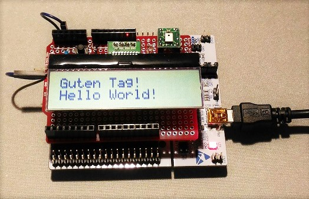
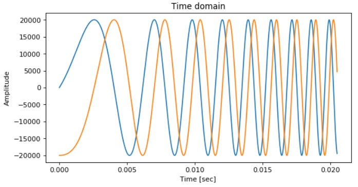
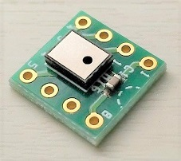
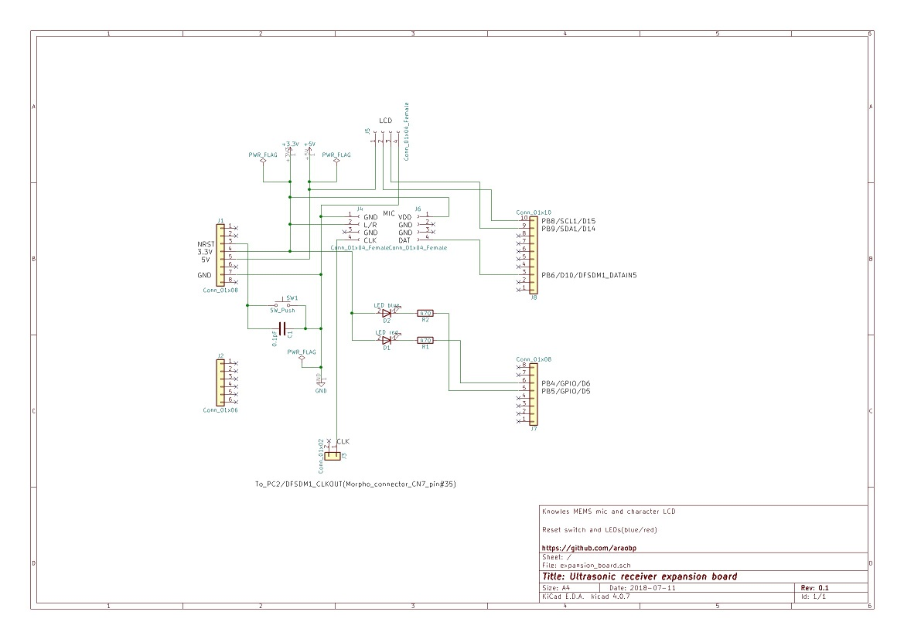
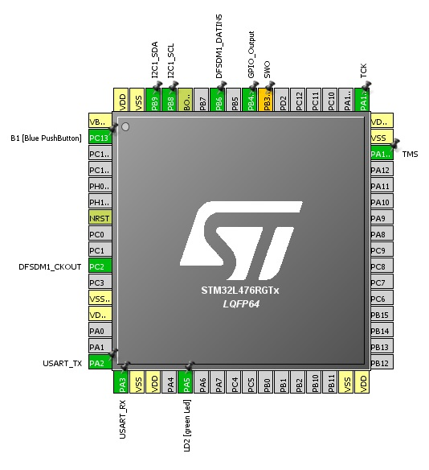
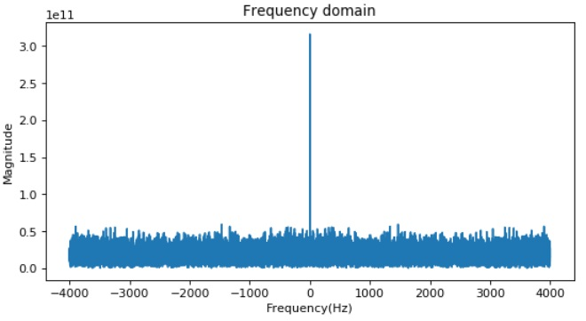

(Nov 30, 2018) This project was not successful: noises disturbed the communication. I am going to test beam forming to improve SNR.

Improvements:
- Sampling frequency: 80000000/32/32 = 78.125kHz --> 80000000/25/64 = 50kHz.
- Complex FFT -> Real FFT
- Beam forming
- Generating pure chirp by DAC on STM32 (to avoid sound effect by Win10 sound device driver).

---
# Learning DSP with ultrasonic communications

## Background and motivation

STMicro gave me STM32L4(Arm Cortex-M4) evaluation board and a pair of MEMS microphones for free at [a trade show held in Makuhari city](https://www.st.com/content/st_com/en/about/events/events.html/techno-frontier-2018.html), Chiba, Japan. Thanks a lot to STMicro!

As an IoT hobyyist, I am becoming interested in DSP with MEMS mic.

Also thanks to this: https://github.com/y2kblog/NUCLEO-L476RG_DFSDM_PDM-Mic.

## Project goal

I am a DSP beginner, so I learn DSP by doing: realize "low-power narrow area networking" by cheap DSP and MEMS mic.

## My work so far

#### Project documentation

==> [Specification](https://docs.google.com/presentation/d/e/2PACX-1vSd3PQnKqmKbjcGNyNh_gygd175jgfzZYH5iwcEPqmmgiy7k3yYzqqHzfs7u-95jm_9hHgc0ugAvv2U/pub?start=false&loop=false&delayms=3000)

#### Platform: STM32L4 platform and FFT test code on MEMS mic

==> [Platform](./experiments/PLATFORM.md)

==> [Test code](./experiments/basic)

#### Mathematical formula expressing ultrasonic wave

I tested frequency-hopping to transmit data over ultra-sonic, resulting in very bad performance at low SNR in a noisy room. So I decided to employ chirp modulation in this project.

==> [Formula](./misc/Formula.ipynb)

#### Developing my original MEMS mic shield

I developed my original shield with Knowles MEMS mic:

- Knowles MEMS mic
- Character LCD
- LED (red)
- Tactile switche (reset)

#### Pinout of STM32L476RG

#### Working code

Code of the ultrasonic receiver running on STM32L476RG (Arm Cortex-M4L) and the original expansion board:

==> [Code](./receiver)

## Next challenge: I/Q modulation

I already made the code, but it did not fit into the RAM, so I will reduce the number of samples to 1024.

But the resolution of FFT w/ I/Q modulation will be still much better than the current implementation (FFT of 2048 samples w/o I/Q modulation).

## Experiments I made over the past month

I have made several experiments over the past month to study how data can be transmitted over ultra-sonic wave: FSK, hopping and chirp. The conclusion is to try Chirp modulation to fight with noise.

#### Ultrasonic communications experiment (FSK modulation)

==> [Experiment](./experiments/EXPERIMENT.md)

==> [Test code](./experiments/ultracom)

#### Ultrasonic communications experiment (Chirp modulation)

==> [Experiment2](./experiments/EXPERIMENT2.md)

==> [Test code](./experiments/chirp)

#### Ultrasonic communications experiment (Chirp modulation with compression)

==> [Experiment3](./experiments/EXPERIMENT3.md)

#### Ultrasonic communications experiment (time frame synchronization)

==> [Experiment4](./experiments/EXPERIMENT4.md)
