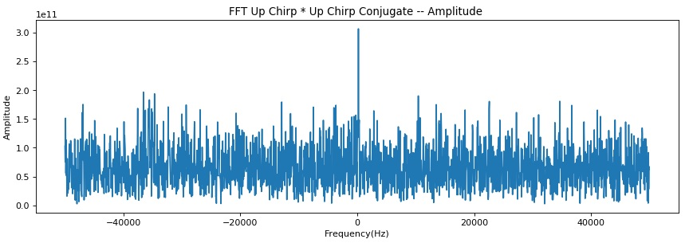

# Ultrasonic communications (STM32L4 DSP w/ MEMS mic)

## Preparation: STM32L4 platform and FFT test code on MEMS mic

This project uses STM32L476RG as MCU/DSP and MP34ST01-M as MEMS microphone:

The system architecture is as follows:

==> [Platform](PLATFORM.md)

==> [Test code](./basic)

## Ultrasonic communications experiment (FSK modulation)

My first idea was FSK modulation of 18 frequencies (18 symboles) to send data on ultrasonic wave. The method worked very well in a silent room, but did not work in a noisy environment such as a meeting room. I had to come up with another approach, such as spread spectrum.

==> [Experiment](EXPERIMENT.md)

==> [Test code](./ultracom)

## Ultrasonic communications experiment (Chirp modulation)

I tested Chirp modulation as one of spread spectrum techniques. It worked! But the noise problem still remained, and the result was useless in a noisy room. I had to come up with a noise suppression technique such as Chirp compression.

==> [Experiment2](EXPERIMENT2.md)

==> [Test code](./chirp)

## Ultrasonic communications experiment (Chirp modulation with compression)

This time, I employ some compression technique, and chirp appears one time within Time Quantum (TQ), unlike the previous experiment.

### Simulation on Jupyter Notebook

I have made some simulation on Jupyter Notebook: https://github.com/araobp/ultrasonic-communication/blob/master/generator/ChirpSimulation.ipynb

Chirp signal is under noise level:

Chirp is identifiable at around 0 Hz:

Chirp is identifiable at around 35000 Hz:

### The first experiment of up x down (June 10, 2018)

It worked!

### Next step

I have to come up with some synchronization technique: synchronization of TQ between the transmitter and the receiver.

## My original MEMS mic shield

I have bought [this MEMS mic](http://akizukidenshi.com/catalog/g/gM-05577/): Knowles SPM0405HD4H. The spec is similar to the mic on the expansion board from STMicro. Although this one does not support ultrasonic, it should be OK.

I am going to make my original shield with Knowles MEMS mic:

- Knowles MEMS mic
- LCDs
- LEDs
- Tactile switches
- CAN tranceiver
