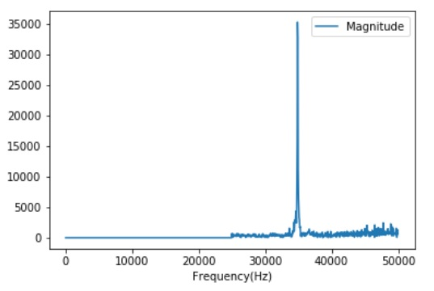
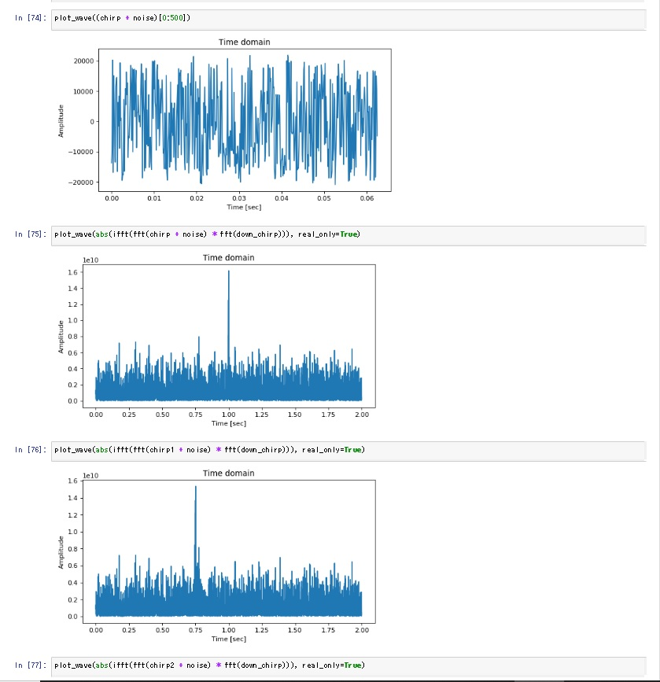

## Ultrasonic communications experiment (Chirp modulation with compression)

This time, I employ some compression technique, and chirp sweep time corresponds to the length of time within time frame, unlike the previous experiment.

This material is great: https://www.ittc.ku.edu/workshops/Summer2004Lectures/Radar_Pulse_Compression.pdf

### The first chirp compression experiment on STM32L4 DSP (June 10, 2018)

I tried Chirp compression in frequency domain (real upchirp * complex down-chip). I transmitted very weak chirp signals (real upchirp) to STM32L4 DSP with MEMS mic. It worked! But I observed two peaks most of time, since the FFT calculation was performed on a chirp signal split into two within the time frame, since the time frame was not in sync between the transmitter and the receiver.



#### How much time does it take to compute complex FFT of 2048 samples?

The measured value is 3msec for each complex FFT of 2048 samples at 80MHz system clock. 2048 samples correspond to 20.5msec at 100kHz sampling rate, so 3msec is short enough compared to 20.5msec.

### Simulation of chirp compression on Jupyter Notebook (June 20, 2018)

I made [chirp compression simulator](../simulation/ChirpSimulation.ipynb) on Jupyter Notebook.

The chirp signal is under white noise:


I made FFT [upchirp * upchirp], then the chirp signal became identifiable at around zero Hz:


I also tried IFFT [FFT[upchirp] * FFT[downchirp]] to simulate Chirp compression in time domain. Again, the chirp signal is under noise level, but the chirp signal is identifiable around zero Hz after compression. The good thing of this technique is that it does not require a larger buffer (i.e., larger memory) for compression processing, and it can also detect phase shift of chirp signal by measuring the shift of peak to the left or to the right:



### The second chirp compression experiment on STM32L4 DSP (June 22, 2018)

The technique of chirp compression in time domain resulted in bad compression in a real experiment on STM32L4 w/ MEMS mic.

On the contrary, an experiment of FFT [upchirp * upchirp] on STM32L4 w/ MEMS mic showed a very good result:


However, I got that this techinique is not so good, since I observed a peak at zero Hz sometimes, even when chirp signal was not transmitted to the receiver. I need to come up with a technique to improve SNR.

### Sync experiment on June 24, 2018

I made the sync code. It seemed to work.

I observed that Magnitude of chirp at a synchronized position (around i=25) was significantly larger than the others. The result below also showed me that one chirp can express multiple symbols: for example, |up|(0), |down|(1), |up0:up1|(2), |down0:down1|(3).

```
Magnitude history:
max: 306946688.0, max_r: 306946688.0, max_l: 46697000.0, s_time: 301404, f_time: 301408, i: 14, i_left: 14, i_right: 78
max: 599477568.0, max_r: 599477568.0, max_l: 22733306.0, s_time: 301382, f_time: 301386, i: 20, i_left: 20, i_right: 41
max: 777540416.0, max_r: 777540416.0, max_l: 53296356.0, s_time: 301408, f_time: 301413, i: 25, i_left: 25, i_right: 40
max: 727269504.0, max_r: 727269504.0, max_l: 248580016.0, s_time: 301386, f_time: 301391, i: 30, i_left: 30, i_right: 40
max: 508824928.0, max_r: 508824928.0, max_l: 447869984.0, s_time: 301413, f_time: 301417, i: 35, i_left: 35, i_right: 42
max: 336429216.0, max_r: 159654848.0, max_l: 336429216.0, s_time: 301391, f_time: 301395, i: 47, i_left: 39, i_right: 47
max: 192139792.0, max_r: 22508948.0, max_l: 192139792.0, s_time: 301417, f_time: 301422, i: 55, i_left: 37, i_right: 55
max: 98077944.0, max_r: 75327512.0, max_l: 98077944.0, s_time: 301396, f_time: 301400, i: 66, i_left: 9, i_right: 66
```


### IQ modulation

I tried IQ modulation to see if SNR improves.

==> [Formula](../misc/Formula.ipynb)

==> [Simulation](./simulation/IQ_modulation.ipynb)

IQ demoduation requires Low-Pass Filter(LPF) to remove unnecessary frequencies for baseband signal analysis. I have made LPF simulation and calculated FIR coefficients.

==> [Simulation](./simulation/FIR%20LPF%20design.ipynb)


However, my C program with "digital" IQ modulation did not fit into RAM on STM32! I gave up this approach, and I will try "Orthogonal Chirp" instead.


